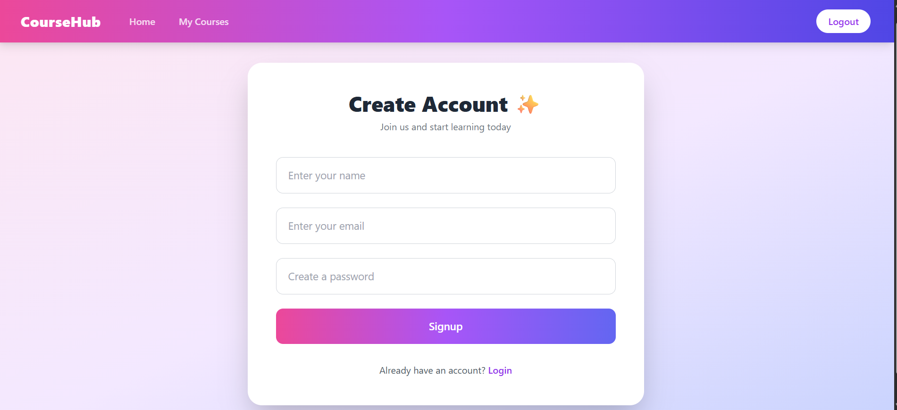
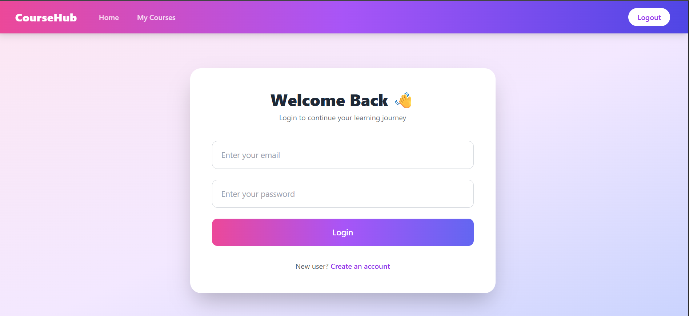
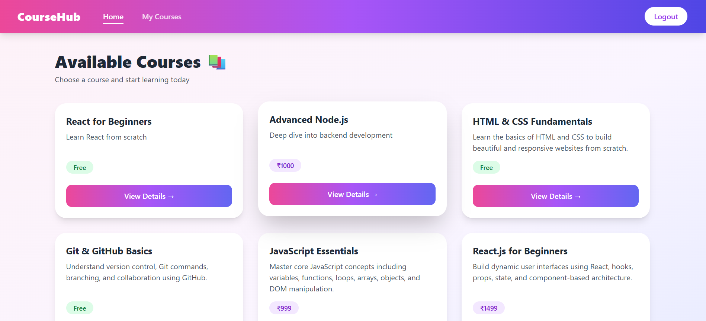
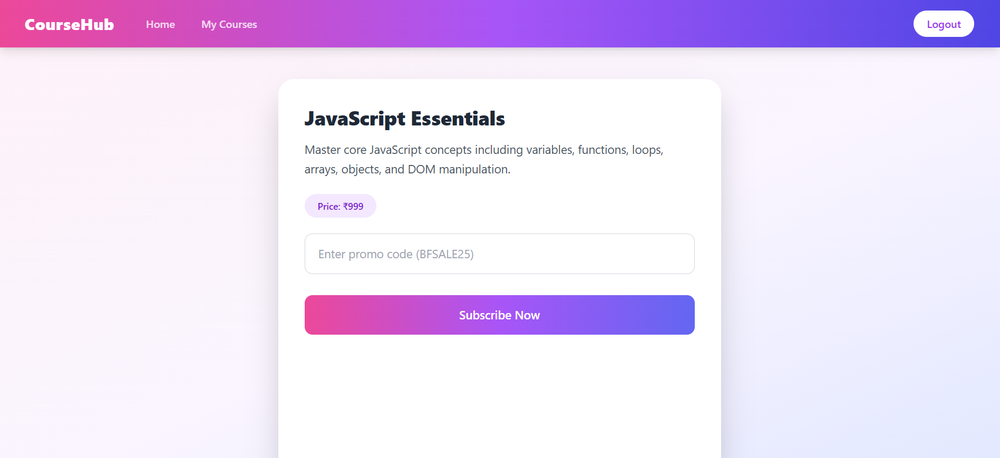

# Course Subscription Platform (MERN Stack)

Welcome to the **Course Subscription Platform** repository.  
This is a full-stack MERN web application that allows users to register, log in, browse available courses, subscribe to free or paid courses, and view their enrolled courses along with subscription details.

---

## 📑 Table of Contents

- [Overview](#overview)
- [Features](#features)
  - [For Users](#for-users)
- [Tech Stack](#tech-stack)
- [Installation (Local Development)](#installation-local-development)
- [Deployment](#deployment)
- [Screenshots](#screenshots)
- [Live Demo](#live-demo)

---

## 📌 Overview

The Course Subscription Platform is designed to simulate a real-world online learning system.

Users can:

- Create an account
- Log in securely using JWT authentication
- Browse courses
- Subscribe to free or paid courses using promo codes
- Track enrolled courses including price paid and subscription date

The platform follows modern development practices with a React frontend and a Node.js + Express backend connected to MongoDB Atlas.

---

## ✨ Features

### For Users

- User registration and login
- JWT-based secure authentication
- Browse all available courses
- Subscribe to free and paid courses
- Promo code support for paid courses
- View subscribed courses including:
  - Course title
  - Price paid
  - Subscription date
- Protected routes for authenticated users
- Toast notifications for actions
- Responsive UI using Tailwind CSS

---

## 🛠️ Tech Stack

### Frontend
- React (Vite)
- Tailwind CSS
- Axios
- React Router DOM
- React Toastify

### Backend
- Node.js
- Express.js
- MongoDB Atlas
- Mongoose
- JSON Web Tokens (JWT)
- bcryptjs

---

## ⚙️ Installation (Local Development)

Follow these steps to set up the project locally:

1. **Clone the repository** 
   ```bash
   git clone https://github.com/your-username/course-subscription-mern.git

2. **Backend Setup**
   ```bash
   cd backend
   npm install

3. **Set up environment variables**
   Create a .env file in the root directory and add the following:
   ```bash
   PORT=5000
   MONGO_URI=your_mongodb_atlas_connection_string
   JWT_SECRET=your_jwt_secret_key

4. **Start the backend server:**
   ```bash
   npm start

5. **Frontend Setup**
   ```bash
   cd ../frontend
   npm install

6. **Update API base URL:**
   ```bash
   baseURL: "http://localhost:5000"

7. **Start frontend:**
   ```bash
   npm run dev


## 🚀 Deployment

### Backend (Render)

- Push backend to GitHub
- Create a Web Service on Render
- Set:
   - Build Command: npm install
   - Start Command: node server.js
- Add environment variables:
   - PORT
   - MONGO_URI
   - JWT_SECRET
- Deploy

### Frontend (Vercel)

- Push frontend to GitHub
- Import project into Vercel
- Set:
   - Framework: Vite
   - Build Command: npm run build
   - Output Directory: dist
- Add vercel.json for React Router routing
- Deploy

## 🖼️ Screenshots

### Signup Page


### Login Page


### Courses Page


### Course Detail Page


### My Courses Page


  


